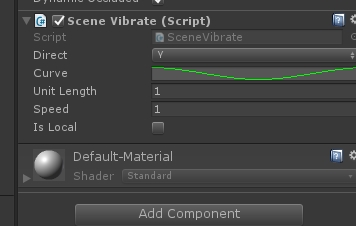

场景中有一些建筑是上下运动的，只要写上一个通用脚本放在那上面就可以了。  
使用截图：  
  
代码：
```csharp
using UnityEngine;
using System.Collections;

public class SceneVibrate : MonoBehaviour
{

    public enum VibrateDirection
    {
        X,
        Y,
        Z
    }

    Vector3 spawnPosition;
    Vector3 nowPosition; // 避免在Update中重复分配地址存储nowPosition
    float time;

    public VibrateDirection direct = VibrateDirection.Y;
    public AnimationCurve curve;
    public float unitLength = 1f; // curve中y值1代表游戏空间中的长度
    public float speed = 0.1f;

    public bool isLocal = false;

    // Use this for initialization
    void Start()
    {
        if (isLocal)
        {
            spawnPosition = transform.localPosition;
            nowPosition = transform.localPosition;
        }
        else
        {
            spawnPosition = transform.position;
            nowPosition = transform.position;
        }
        time = 0;
    }

    // Update is called once per frame
    void Update()
    {
        // 不直接使用Time.time，避免关闭->开启时的瞬移问题
        var deltaTime = Time.deltaTime;
        time += deltaTime;

        var curveValue = curve.Evaluate(time * speed);
        var targetDistance = unitLength * curveValue;

        nowPosition = spawnPosition;
        switch (direct)
        {
            case VibrateDirection.X:
                nowPosition.x = spawnPosition.x + targetDistance;
                break;
            case VibrateDirection.Y:
                nowPosition.y = spawnPosition.y + targetDistance;
                break;
            case VibrateDirection.Z:
                nowPosition.z = spawnPosition.z + targetDistance;
                break;
        }
        if (isLocal)
        {
            transform.localPosition = nowPosition;
        }
        else
        {
            transform.position = nowPosition;
        }
    }
}
```
